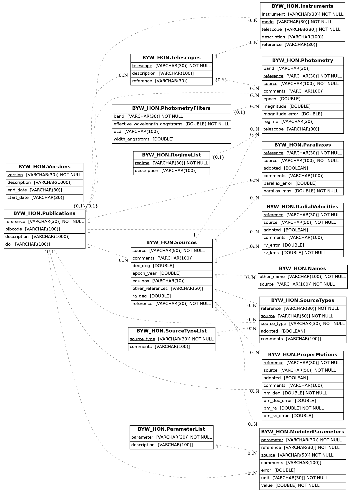

BYW-astrodb
---------------------------

A database of a subsample of Backyard Worlds object follow-up spectroscopic observations. The database contains photometric and astrometric measurements of the sources. The database will eventually include value-added parameters from analysis such as spectral types, and model-derived parameters (Teff, logg, [M/H]). 
This database is built from the astrodb template database ([https://github.com/astrodbtoolkit](https://github.com/astrodbtoolkit/astrodb-template-db)). 

Entity relationship diagram of the schema [not correct, still under construction]

